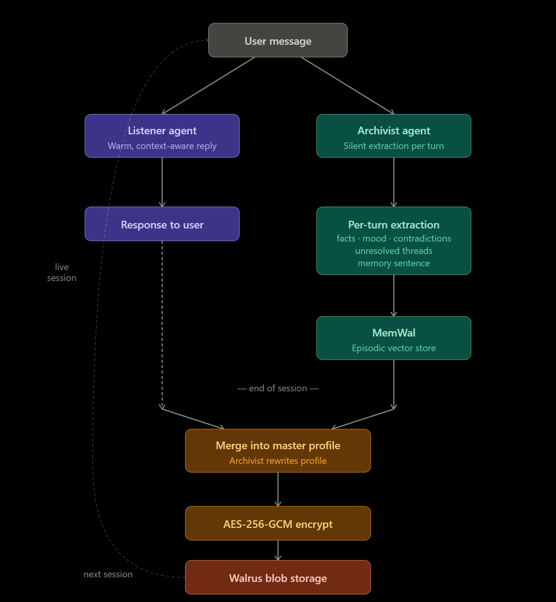
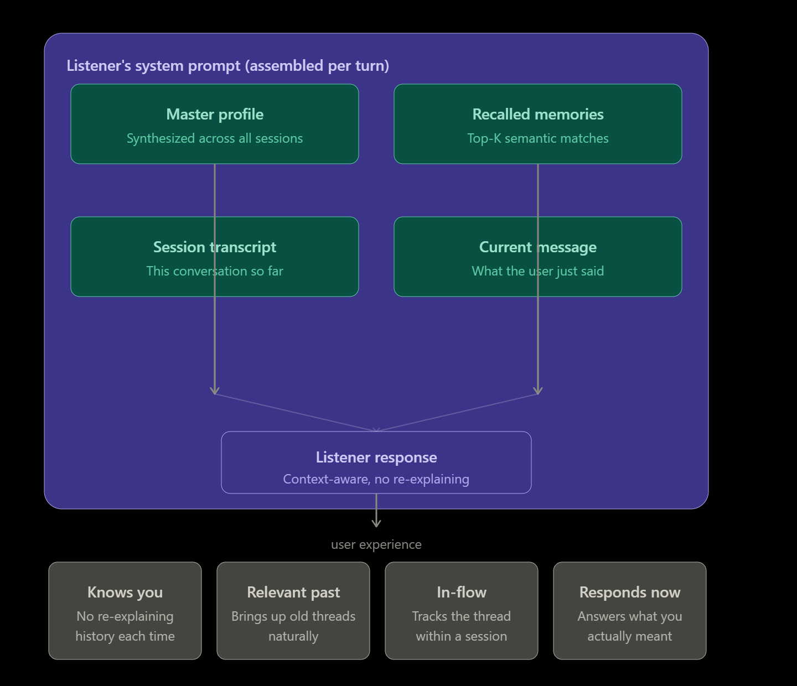

# Mnemo — AI Companion with Persistent Cross-Session Memory

> *Most AI chatbots have the memory of a goldfish. Mnemo doesn't.*

Mnemo is an AI mental health companion that remembers you across sessions. A silent background agent continuously synthesizes your conversations into an evolving psychological profile, so every new session feels like picking up with someone who already knows you — not explaining yourself from scratch again.

Built for the **Sui Overflow Hackathon**, Mnemo decouples AI compute from storage entirely: your profile never touches a corporate database. It's encrypted client-side with AES-256-GCM and stored on the decentralized **Walrus** network.

---

## Demo


---

## How It Works





Mnemo runs two agents simultaneously on every message:

```
User Message
     │
     ├──▶  Listener Agent   ──▶  Response to user
     │     (conversational,        (warm, context-aware,
     │      emotionally aware)      no overvalidation)
     │
     └──▶  Archivist Agent  ──▶  Structured extraction
           (silent, analytical)    facts · mood · contradictions
                                   unresolved threads
                                        │
                                        ▼
                                   MemWal (episodic memory)
                                   semantic vector store
                                        │
                              ┌─────────┘
                              │  End of session
                              ▼
                         Merge extraction
                         into Master Profile
                              │
                              ▼
                    AES-256-GCM encryption
                              │
                              ▼
                      Walrus blob storage
                      (decentralized, persistent)
```

Every subsequent session loads the encrypted profile from Walrus, decrypts it, and retrieves the most semantically relevant episodic memories via MemWal — so the Listener always has full context before saying a single word.

---

## Architecture

### Dual-Agent Pipeline

| Agent | Role | Visibility |
|---|---|---|
| **Listener** | Conversational companion. Warm, direct, never over-validating. | User-facing |
| **Archivist** | Silent analyst. Extracts structured insight from every exchange. | Background |

The two agents never talk to each other in real time. The Archivist runs *after* the Listener responds, processing the exchange asynchronously.

### Memory Layers

| Layer | Technology | What's stored |
|---|---|---|
| Episodic (per-turn) | MemWal | Memory sentences, emotional context, facts, contradictions |
| Semantic retrieval | MemWal embeddings | Top-K relevant memories retrieved per session |
| Long-term profile | Walrus (encrypted) | Synthesized master profile, updated each session |

### Storage & Encryption

Profile data never touches a centralised server. The pipeline:

1. Archivist merges today's insights into the master profile (plain text).
2. AES-256-GCM encryption using a key derived via PBKDF2 (100,000 iterations, SHA-256) — the raw secret is never used directly as a key.
3. A random 96-bit IV is generated per upload; the GCM auth tag is verified on every read.
4. The ciphertext is uploaded to Walrus via its publisher API. The returned blob ID is persisted locally so the next session loads it automatically.

On-chain access control via **Mysten Seal** is the planned upgrade once a Move package is deployed to Sui testnet. Current encryption is symmetric with a server-held key — see [Limitations](#limitations).

---

## Tech Stack

| Layer | Technology |
|---|---|
| Frontend | Next.js 14, TypeScript |
| LLM | Gemini 3.0 Flash Lite (`@google/genai`) |
| Episodic memory | MemWal (`@mysten-incubation/memwal`) |
| Long-term storage | Walrus testnet (blob storage) |
| Encryption | Node.js `crypto` — AES-256-GCM + PBKDF2 |
| Ecosystem | Sui / Walrus |

---

## Project Structure

```
mental-health-agent/
├── app/
│   ├── api/
│   │   ├── chat/
│   │   │   └── route.ts          # Per-turn: Listener response + Archivist extraction
│   │   ├── init/
│   │   │   └── route.ts          # Session init: load blob from Walrus, recall memories
│   │   └── session-end/
│   │       └── route.ts          # Session close: merge profile, encrypt, upload to Walrus
│   ├── globals.css
│   ├── layout.tsx
│   ├── page.module.css
│   └── page.tsx                  # Chat UI with memory panel (This Turn / Recalled / Profile)
├── lib/
│   ├── agents.ts                 # Core: Listener agent, Archivist agent, encryption, Walrus I/O
│   └── blobStore.ts              # Server-side blob ID persistence (mnemo-state.json)
├── mnemo-state.json              # Auto-written after each session; tracks latest blob ID
├── .env.local                    # Keys (gitignored)
├── next.config.js
├── package.json
└── README.md
```

---

## Getting Started

### Prerequisites

- Node.js 18+
- A Gemini API key ([Google AI Studio](https://aistudio.google.com))
- A MemWal account and private key ([MemWal docs](https://github.com/mysten-incubation/memwal))

### Installation

```bash
git clone https://github.com/spheric09/mnemo.git
cd mnemo
npm install
```

### Environment Variables

Create `.env.local` in the project root:

```env
# Gemini
GEMINI_API_KEY=your_gemini_api_key

# MemWal (episodic memory)
MEMWAL_PRIVATE_KEY=your_memwal_private_key
MEMWAL_ACCOUNT_ID=your_memwal_account_id

# Encryption (min 16 chars — used for PBKDF2 key derivation, never stored directly)
ENCRYPTION_SECRET=your_strong_secret_here

# Optional: bootstrap blob ID for an existing profile
PREVIOUS_PROFILE_BLOB_ID=
```

### Run

```bash
npm run dev
```

Open [http://localhost:3000](http://localhost:3000).

On first run, Mnemo starts with an empty profile. After your first session ends ("End Session"), it synthesizes your profile, encrypts it, uploads it to Walrus, and saves the blob ID to `mnemo-state.json`. Every subsequent session loads from there automatically.

---

## Key Features

- **Persistent memory across sessions** — no re-explaining yourself. The Archivist synthesizes a master profile that evolves with every conversation.
- **Dual-agent architecture** — Listener and Archivist are deliberately separated. The conversational agent never gets bogged down in extraction logic.
- **Real encryption** — AES-256-GCM with PBKDF2 key derivation. IV is randomised per upload; auth tag is verified on every read. Not base64, not "encryption."
- **Decentralised storage** — profile blobs live on Walrus, not a corporate database.
- **Semantic memory retrieval** — MemWal retrieves the most contextually relevant past memories per session, not just the most recent ones.
- **Transparent memory UI** — a side panel shows exactly what the Archivist extracted this turn, what memories were recalled, and the current master profile. Nothing is hidden.
- **Resilient I/O** — both Gemini and Walrus calls have retry logic with exponential backoff for transient failures.

---

## Limitations

These are known, honest gaps — not roadmap vaporware:

- **Single shared encryption key.** The current implementation uses one `ENCRYPTION_SECRET` for all users. Per-user key derivation (e.g., wallet-derived keys via Mysten Seal) is the intended upgrade path once a Move package is deployed.
- **Single-tenant.** `blobStore.ts` persists one blob ID globally in `mnemo-state.json`. Multi-user support requires a userId-keyed store (database or on-chain object).
- **MemWal is centralised.** Episodic memory is stored via MemWal's managed service, not on-chain directly.
- **No Move contract yet.** Walrus is used via its HTTP publisher API. On-chain access control is roadmap.
- **Not a therapist.** Mnemo is a conversational companion, not a clinical tool. It has no crisis detection or escalation to emergency services. Do not use it as a substitute for professional mental health care.

---

## Roadmap

- [ ] Per-user encryption keys derived from Sui wallet signatures (Mysten Seal)
- [ ] Move smart contract for on-chain profile ownership and access control
- [ ] Multi-user support with wallet-based auth
- [ ] Crisis detection with pre-written safe responses and resource links
- [ ] Memory editing UI — let users correct or delete specific memories
- [ ] Export: download your full profile as plaintext

---

## Built at Sui Overflow Hackathon

Mnemo was initially built as a submission to the [Sui Overflow Hackathon](https://sui.io/overflow) but was never submitted. The core insight driving it: the bottleneck in AI memory isn't storage — it's *interpretation*. Knowing what to remember, how to weight it, and how to build a live model of a person over time. The Archivist is an attempt at that.

---

## License

MIT
